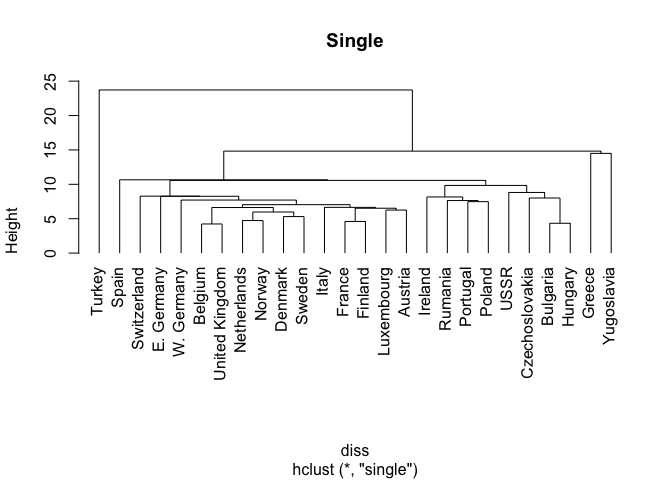
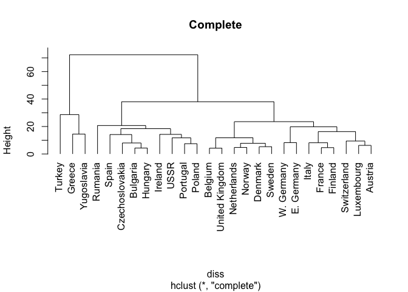
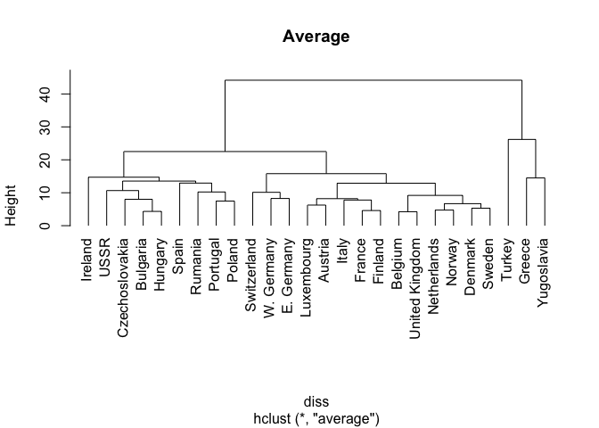
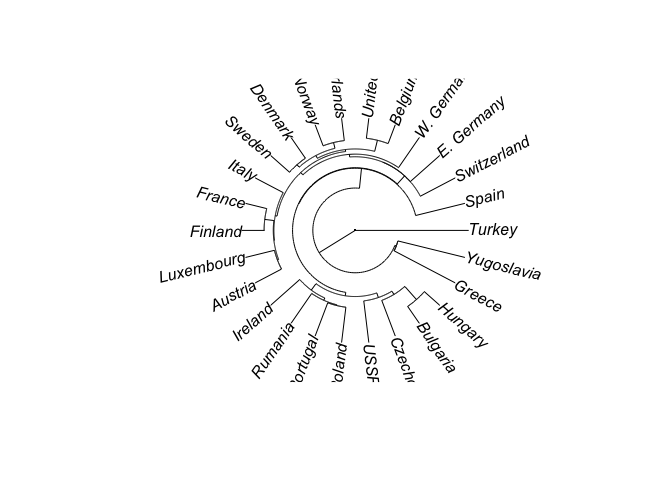
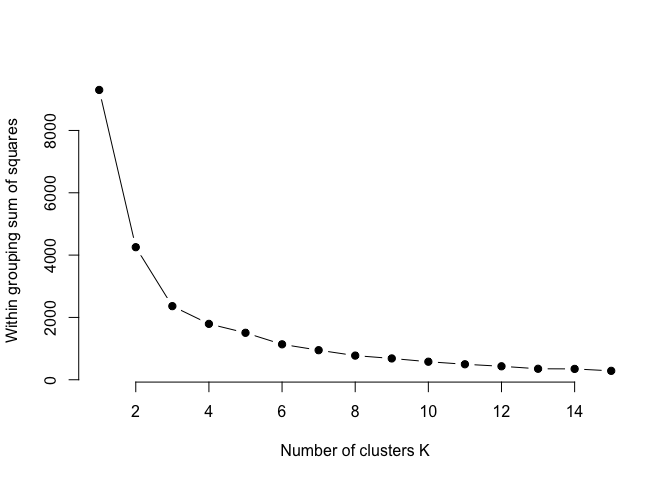

Clustering - Agglomerative & K-Means
================
Amitesh Shukla
2/27/2018

## Agglomerative clustering of Europen Job Data (single link, complete link, and group average clustering)

``` r
data <- read.csv("europe", sep = "")

diss <- dist(data, method = "euclidean")
labels<-as.character(data[,1])
sing<-hclust(diss, method = "single")
plot(sing, hang = -1, main = "Single")
```

<!-- -->

``` r
comp<-hclust(diss, method = "complete")
plot(comp, hang = -1, main = "Complete")
```

<!-- -->

``` r
avg<-hclust(diss, method = "average")
plot(avg,  hang = -1, main = "Average")
```

<!-- -->

## Single dendrogram:

## Single dendrogram provides few important information about the clusters in this data set.

## It is clear that Turkey in terms of occupation was quite different from other countries and may form a separate cluster itself. From the data it is clear that people mostly were occupied in agriculture.

## Similarly Greece and Yugoslavia appear to be clustering together and looks distant from other countries.

## It exposes 3 more major clusters in terms of occupation similarity - West European countries, East European countries and mid European countries.

## So single method looks to form approximately 5 major clusters.

## Complete dendrogram:

## This exposes approximately 4 major clusters. In this looks like cluster Turkey got merged with Greece/Yugoslavia.

## This method does a better job separating countries(sub clusters) among other clusters seen in single dendrogram.

## This exposes some differences(clusters) within other regions.

## Average dendrogram:

## This looks to form clusters which are not extremes like single or complete. Clearly it provides cluster separation with granularity more than single but little bit conservative as compared to complete dendrogram.

``` r
library(ape)
plot(as.phylo(sing), type='fan')
```

<!-- -->

## k-means clustering of Europen Job Data

``` r
set.seed(123)
within_values<-array(data = 0,dim = 15)
# function to compute total within-cluster sum of square
wss <- function(k) {
  p1km<-kmeans(data, k, nstart = 10 )$tot.withinss
}

# Compute and plot wss for k = 1 to k = 15
k.values <- 1:15

for (km in 1:15) {
   within_values[km]<-wss(km)
}
plot(k.values, within_values,
       type="b", pch = 19, frame = FALSE,
       xlab="Number of clusters K",
       ylab="Within grouping sum of squares")
```

<!-- -->

## It is clear from the elbow diagram that a good choice of number of cluster for this data set could k = 6 or k = 7 or k = 8 as it seems to represent sufficient/efficient encoding of the data set.

``` r
kmdata<-kmeans(data, 7, nstart = 10, iter.max = 1000 ,algorithm="MacQueen")
kmdata
```

    ## K-means clustering with 7 clusters of sizes 6, 1, 7, 4, 1, 3, 4
    ## 
    ## Cluster means:
    ##         Agr       Min      Man        PS      Con        SI      Fin
    ## 1 10.250000 1.1833333 31.61667 0.8833333 8.983333 17.016667 4.566667
    ## 2 66.800000 0.7000000  7.90000 0.1000000 2.800000  5.200000 1.100000
    ## 3  7.085714 0.5428571 25.18571 0.9714286 8.071429 16.371429 5.914286
    ## 4 26.250000 1.1500000 24.85000 0.8750000 8.950000 11.825000 3.725000
    ## 5  4.200000 2.9000000 41.20000 1.3000000 7.600000 11.200000 1.200000
    ## 6 41.600000 1.4000000 21.50000 0.7666667 7.233333  7.933333 5.000000
    ## 7 21.375000 2.3250000 30.80000 1.0750000 8.500000  8.175000 0.750000
    ##         SPS       TC
    ## 1 19.400000 6.066667
    ## 2 11.900000 3.200000
    ## 3 28.557143 7.328571
    ## 4 16.350000 6.050000
    ## 5 22.100000 8.400000
    ## 6  9.333333 5.233333
    ## 7 19.225000 7.750000
    ## 
    ## Clustering vector:
    ##        Belgium        Denmark         France     W. Germany        Ireland 
    ##              3              3              1              1              4 
    ##          Italy     Luxembourg    Netherlands United Kingdom        Austria 
    ##              1              1              3              3              1 
    ##        Finland         Greece         Norway       Portugal          Spain 
    ##              3              6              3              4              4 
    ##         Sweden    Switzerland         Turkey       Bulgaria Czechoslovakia 
    ##              3              1              2              7              7 
    ##     E. Germany        Hungary         Poland        Rumania           USSR 
    ##              5              7              4              6              7 
    ##     Yugoslavia 
    ##              6 
    ## 
    ## Within cluster sum of squares by cluster:
    ## [1] 230.5633   0.0000 224.9771 214.7025   0.0000 326.6933 126.2775
    ##  (between_SS / total_SS =  87.9 %)
    ## 
    ## Available components:
    ## 
    ## [1] "cluster"      "centers"      "totss"        "withinss"    
    ## [5] "tot.withinss" "betweenss"    "size"         "iter"        
    ## [9] "ifault"
