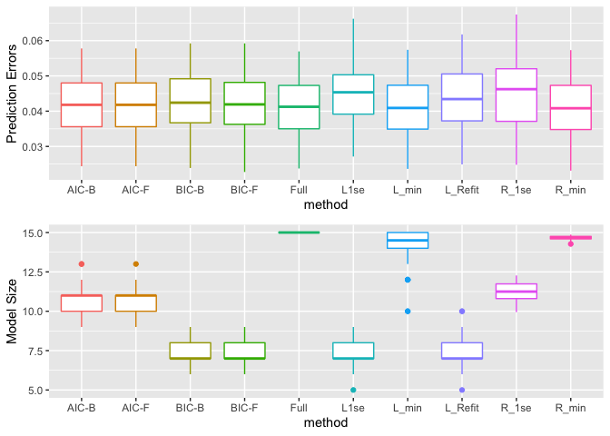
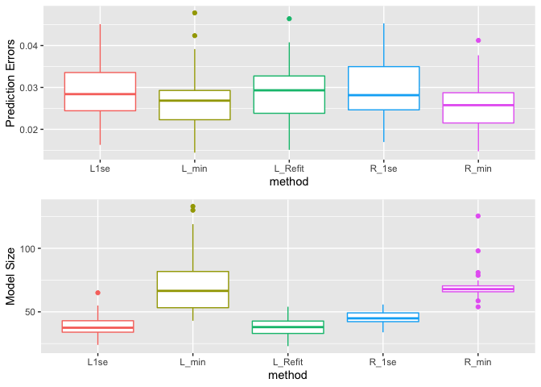
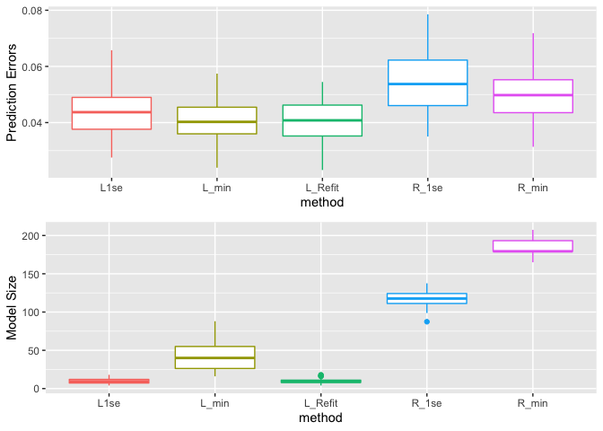

Boston\_Housing\_Amitesh\_Shukla
================

## Boston Housing Data Prediction

    ## Loading objects:
    ##   Housing1

## MSPE on the test data for each procedure (Full, AIC-F, AIC-B, BIC-F, BIC-B, L\_1se, L\_min, R\_1se and R\_min)

<!-- -->

``` r
## Computation time for each procedure
rTime
```

    ##    Full AIC-F AIC-B BIC-F BIC-B  L1se L_min L_Refit R_1se R_min
    ## 1 0.147 4.225 2.016 2.932 2.856 3.895 3.804   3.784 3.839 3.829

## Boston Housing 2 Data Prediction

    ## Loading objects:
    ##   Housing2

## MSPE on the test data for each procedure (L\_1se, L\_min, R\_1se, L\_Refit and R\_min)

<!-- -->

``` r
## Computation time
rTime
```

    ##     R_min   R_1se  L_min   L1se L_Refit
    ## 1 101.715 104.081 79.821 79.286  80.087

## Boston Housing 3 Data Prediction which has adiitional 500 noise features

    ## Loading objects:
    ##   Housing3

## MSPE on the test data for each procedure (L\_1se, L\_min, R\_1se, L\_Refit and R\_min)

<!-- -->

``` r
## Computation time
rTime
```

    ##     R_min   R_1se   L_min    L1se L_Refit
    ## 1 142.242 142.048 189.265 191.781 189.874
