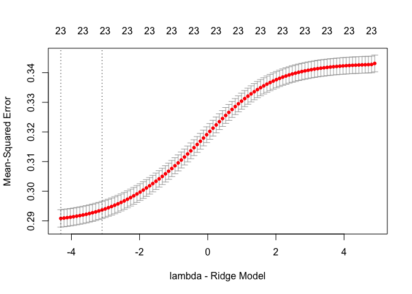
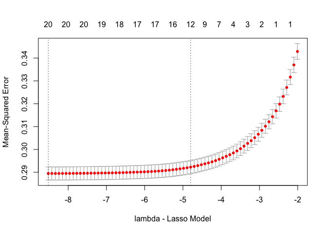
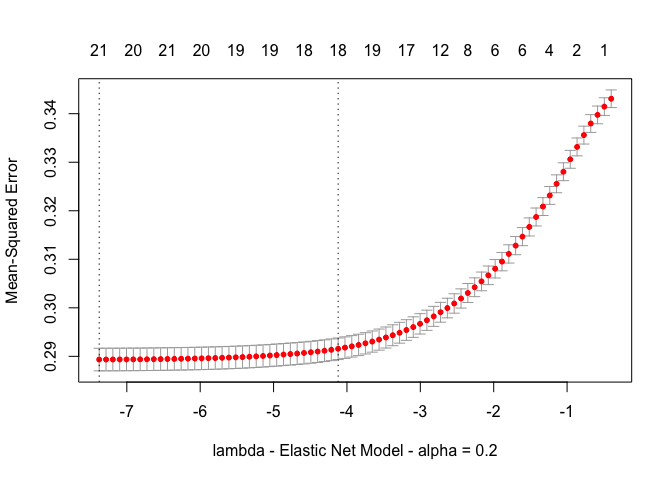
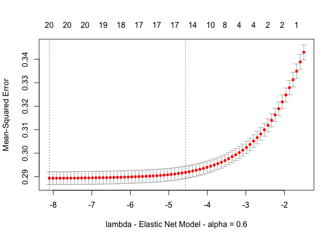
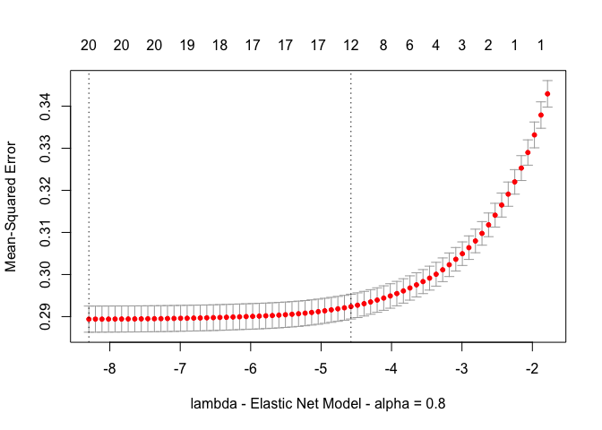

Credit Card Default - Amitesh Shukla
================

## Logistic Regression - Credit card default predictions of the data set at <http://archive.ics.uci.edu/ml/datasets/default+of+credit+card+clients>

    ## Loading required package: lattice

    ## Loading required package: ggplot2

    ##           used  (Mb) gc trigger  (Mb) limit (Mb) max used  (Mb)
    ## Ncells 1895850 101.3    3802740 203.1         NA  2453227 131.1
    ## Vcells 4727712  36.1   10146329  77.5      16384  6973266  53.3

    ## NULL

    ## NULL

    ## NULL

## Accuracy from simple model without regularization

``` r
accuracy
```

    ## [1] 0.8081667

## With Ridge regularization(L2 Regularized)

    ## Loading required package: Matrix

    ## Loading required package: foreach

    ## Loaded glmnet 2.0-18

    ## [1] 0.04498946

    ## [1] 0.01342327

    ## [1] 0.290817

    ## 24 x 1 sparse Matrix of class "dgCMatrix"
    ##                         1
    ## (Intercept) -8.332530e-01
    ## LIMIT_BAL   -6.915589e-07
    ## SEX         -8.040386e-02
    ## EDUCATION   -5.913901e-02
    ## MARRIAGE    -1.120235e-01
    ## AGE          5.728235e-03
    ## PAY_0        4.139155e-01
    ## PAY_2        1.131369e-01
    ## PAY_3        7.200008e-02
    ## PAY_4        3.907777e-02
    ## PAY_5        4.269537e-02
    ## PAY_6        2.318402e-02
    ## BILL_AMT1   -9.791789e-07
    ## BILL_AMT2   -3.945043e-07
    ## BILL_AMT3   -2.558216e-07
    ## BILL_AMT4   -5.528557e-08
    ## BILL_AMT5    2.199725e-07
    ## BILL_AMT6    1.201329e-07
    ## PAY_AMT1    -6.671526e-06
    ## PAY_AMT2    -3.636123e-06
    ## PAY_AMT3    -2.386771e-06
    ## PAY_AMT4    -3.030086e-06
    ## PAY_AMT5    -3.915445e-06
    ## PAY_AMT6    -2.115481e-06

<!-- -->

# Accuracy with ridge regularized model

``` r
accuracy
```

    ## [1] 0.8043333

## Lasso regularization(L1 Regularized)

``` r
library(glmnet)

cvtrain<-train[,-24]

modellasso <- cv.glmnet(x=data.matrix(cvtrain), y=train$trclass, alpha=1,family="binomial",type.measure = "mse")
lme<-modellasso$lambda.min
lse<-modellasso$lambda.1se

i <- which(modellasso$lambda == modellasso$lambda.min)
mse.min <- modellasso$cvm[i]
lse
```

    ## [1] 0.008236392

``` r
lme
```

    ## [1] 0.0001993313

``` r
mse.min
```

    ## [1] 0.2894771

``` r
coef(modellasso)
```

    ## 24 x 1 sparse Matrix of class "dgCMatrix"
    ##                         1
    ## (Intercept) -1.169064e+00
    ## LIMIT_BAL   -6.401099e-07
    ## SEX          .           
    ## EDUCATION    .           
    ## MARRIAGE    -4.569779e-02
    ## AGE          2.136885e-03
    ## PAY_0        5.703146e-01
    ## PAY_2        7.085337e-02
    ## PAY_3        6.761102e-02
    ## PAY_4        2.890669e-03
    ## PAY_5        2.644821e-02
    ## PAY_6        .           
    ## BILL_AMT1   -1.232018e-06
    ## BILL_AMT2    .           
    ## BILL_AMT3    .           
    ## BILL_AMT4    .           
    ## BILL_AMT5    .           
    ## BILL_AMT6    .           
    ## PAY_AMT1    -4.916399e-06
    ## PAY_AMT2    -7.074116e-07
    ## PAY_AMT3     .           
    ## PAY_AMT4     .           
    ## PAY_AMT5    -1.312797e-06
    ## PAY_AMT6     .

``` r
plot(modellasso, xlab="lambda - Lasso Model")
```

<!-- -->

``` r
lasso_pred <- plogis(predict(modellasso, s=lme,newx=data.matrix(test)))
p_pred <- lasso_pred >= 0.5

gotright<-teclass == p_pred
accuracy<-sum(gotright)/
   (sum(gotright)+sum(!gotright))
```

# Accuracy with lasso regularized model

``` r
accuracy
```

    ## [1] 0.8083333

## Elastic Net regularization

``` r
library(glmnet)

cvtrain<-train[,-24]

modelen.2 <- cv.glmnet(x=data.matrix(cvtrain), y=train$trclass, alpha=0.2,family="binomial",type.measure = "mse")
lme<-modelen.2$lambda.min
lse<-modelen.2$lambda.1se
i <- which(modelen.2$lambda == modelen.2$lambda.min)
mse.min <- modelen.2$cvm[i]
lse
```

    ## [1] 0.01624301

``` r
lme
```

    ## [1] 0.0006259292

``` r
mse.min
```

    ## [1] 0.2893396

``` r
coef(modelen.2)
```

    ## 24 x 1 sparse Matrix of class "dgCMatrix"
    ##                         1
    ## (Intercept) -9.491303e-01
    ## LIMIT_BAL   -6.785227e-07
    ## SEX         -5.478817e-02
    ## EDUCATION   -4.214851e-02
    ## MARRIAGE    -9.634573e-02
    ## AGE          4.880846e-03
    ## PAY_0        5.154299e-01
    ## PAY_2        9.419620e-02
    ## PAY_3        6.785638e-02
    ## PAY_4        2.345858e-02
    ## PAY_5        3.884665e-02
    ## PAY_6        3.165261e-03
    ## BILL_AMT1   -1.380974e-06
    ## BILL_AMT2    .           
    ## BILL_AMT3    .           
    ## BILL_AMT4    .           
    ## BILL_AMT5    .           
    ## BILL_AMT6    .           
    ## PAY_AMT1    -7.020815e-06
    ## PAY_AMT2    -3.202676e-06
    ## PAY_AMT3    -9.120995e-07
    ## PAY_AMT4    -1.672386e-06
    ## PAY_AMT5    -3.206316e-06
    ## PAY_AMT6    -1.120521e-06

``` r
plot(modelen.2, xlab="lambda - Elastic Net Model - alpha = 0.2")
```

<!-- -->

``` r
en_pred <- plogis(predict(modelen.2, s=lme,newx=data.matrix(test)))
p_pred <- en_pred >= 0.5

gotright<-teclass == p_pred
accuracy<-sum(gotright)/
   (sum(gotright)+sum(!gotright))
accuracy
```

    ## [1] 0.8086667

``` r
modelen.6 <- cv.glmnet(x=data.matrix(cvtrain), y=train$trclass, alpha=0.6,family="binomial",type.measure = "mse")
lme<-modelen.6$lambda.min
lse<-modelen.6$lambda.1se

i <- which(modelen.6$lambda == modelen.6$lambda.min)
mse.min <- modelen.6$cvm[i]
lse
```

    ## [1] 0.01038421

``` r
lme
```

    ## [1] 0.0003027054

``` r
mse.min
```

    ## [1] 0.2893377

``` r
coef(modelen.6)
```

    ## 24 x 1 sparse Matrix of class "dgCMatrix"
    ##                         1
    ## (Intercept) -1.100084e+00
    ## LIMIT_BAL   -6.453402e-07
    ## SEX         -2.216170e-02
    ## EDUCATION   -6.867865e-03
    ## MARRIAGE    -6.572980e-02
    ## AGE          3.172836e-03
    ## PAY_0        5.519256e-01
    ## PAY_2        8.008616e-02
    ## PAY_3        6.672671e-02
    ## PAY_4        1.236850e-02
    ## PAY_5        3.126047e-02
    ## PAY_6        .           
    ## BILL_AMT1   -1.331709e-06
    ## BILL_AMT2    .           
    ## BILL_AMT3    .           
    ## BILL_AMT4    .           
    ## BILL_AMT5    .           
    ## BILL_AMT6    .           
    ## PAY_AMT1    -5.878895e-06
    ## PAY_AMT2    -1.743184e-06
    ## PAY_AMT3     .           
    ## PAY_AMT4    -5.812211e-07
    ## PAY_AMT5    -2.099760e-06
    ## PAY_AMT6    -1.404076e-07

``` r
plot(modelen.6, xlab="lambda - Elastic Net Model - alpha = 0.6")
```

<!-- -->

``` r
en_pred <- plogis(predict(modelen.6, s=lme,newx=data.matrix(test)))
p_pred <- en_pred >= 0.5

gotright<-teclass == p_pred
accuracy<-sum(gotright)/
   (sum(gotright)+sum(!gotright))
accuracy
```

    ## [1] 0.8085

``` r
modelen.8 <- cv.glmnet(x=data.matrix(cvtrain), y=train$trclass, alpha=0.8,family="binomial",type.measure = "mse")
lme<-modelen.8$lambda.min
lse<-modelen.8$lambda.1se

i <- which(modelen.8$lambda == modelen.8$lambda.min)
mse.min <- modelen.8$cvm[i]
lse
```

    ## [1] 0.01029549

``` r
lme
```

    ## [1] 0.0002491641

``` r
mse.min
```

    ## [1] 0.2893961

``` r
coef(modelen.8)
```

    ## 24 x 1 sparse Matrix of class "dgCMatrix"
    ##                         1
    ## (Intercept) -1.166040e+00
    ## LIMIT_BAL   -6.420779e-07
    ## SEX          .           
    ## EDUCATION    .           
    ## MARRIAGE    -4.524833e-02
    ## AGE          2.103678e-03
    ## PAY_0        5.581193e-01
    ## PAY_2        7.530123e-02
    ## PAY_3        6.568753e-02
    ## PAY_4        5.772502e-03
    ## PAY_5        2.651607e-02
    ## PAY_6        .           
    ## BILL_AMT1   -1.208700e-06
    ## BILL_AMT2    .           
    ## BILL_AMT3    .           
    ## BILL_AMT4    .           
    ## BILL_AMT5    .           
    ## BILL_AMT6    .           
    ## PAY_AMT1    -4.843160e-06
    ## PAY_AMT2    -7.558306e-07
    ## PAY_AMT3     .           
    ## PAY_AMT4     .           
    ## PAY_AMT5    -1.342015e-06
    ## PAY_AMT6     .

``` r
plot(modelen.8, xlab="lambda - Elastic Net Model - alpha = 0.8")
```

<!-- -->

``` r
en_pred <- plogis(predict(modelen.8, s=lme,newx=data.matrix(test)))
p_pred <- en_pred >= 0.5

gotright<-teclass == p_pred
accuracy<-sum(gotright)/
   (sum(gotright)+sum(!gotright))
```

# Accuracy with elastic net

``` r
accuracy
```

    ## [1] 0.8083333
