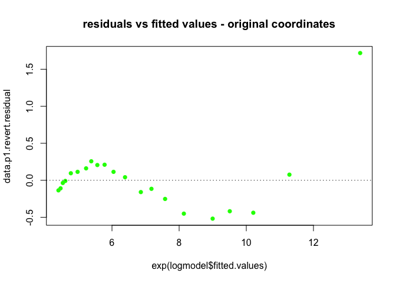

Linear\_Regression\_Amitesh\_Shukla
================
Amitesh Shukla
3/10/2018

## Predictive model for thhe data set at <http://www.statsci.org/data/general/brunhild.html>, measures the concentration of a sulfate in the blood of a baboon named Brunhilda as a function of time.

``` r
data.p1<-read.csv("data.p1", sep = "")
data.log<-data.p1
data.log$Sulfate<-log(data.p1$Sulfate)
data.log$Hours<-log(data.p1$Hours)
logmodel <- lm(Sulfate ~ Hours, data=data.log)
```

``` r
plot(data.log, main = "data point and the regression line - log log coordinates")
abline(logmodel, col = "red")
```

<!-- -->

``` r
require(graphics)
plot(data.p1, main = "data point and the regression line - original coordinates")
l<-exp(logmodel$fitted.values)
lines(data.p1$Hours, l, col="blue" )
```

<!-- -->

``` r
plot(logmodel$fitted.values,logmodel$residuals, type = "p",pch=16, col="purple",yaxt="n",
     main = "residuals vs fitted values - log log coordinates")
ticks<-c(-0.05,-0.025,0,0.025,0.05,0.075,0.10)
axis(2,at=ticks,labels=ticks)
abline(a=0,b=0, lty="dotted")
```

<!-- -->

``` r
data.p1.revert.residual = data.p1$Sulfate - exp(logmodel$fitted.values)
plot(exp(logmodel$fitted.values),data.p1.revert.residual, type = "p",pch=16, col="green",
     main = "residuals vs fitted values - original coordinates")
abline(a=0,b=0, lty="dotted")
```

<!-- -->

## The log-log regression model built on the given data set looks average at the best. The plots above shows that the regression line defines and fits the overall trend data set well. The model captures the essence that the quantity of the sulphate decreases rapidly in the begining.

## The quantity of sulfate in the first hour is quiet large and may be diagnosed further if it is influencing the model negatively or if it is an outlier.

## The log-log residual plot looks to be centered around 0 \[-0.0.25 , 0.5\], which is a good sign as the errors are not too far from 0. But they do not seem to be symetrical across x axis.

## Overall the model looks healthy for predictions but there look to be pattern in the residual values. They doesn’t look to be completely random. We see a curvy pattern and at few points next residuals can be clearly predicted.

## This tells us that although predictions may look good on the given data set, due to pattern in the residual values, some of the explanatory/predictive information is leaking in the residuals.

## Linear regression model for the data set at <http://www.statsci.org/data/oz/physical.html>, which measures body mass, and various diameters.

``` r
data.p2<-read.csv("data.p2", sep = "")
```

``` r
modelp2 <- lm(Mass ~ ., data=data.p2)
modelp2cube <- lm(Mass^(1/3) ~ ., data=data.p2)
```

``` r
plot(modelp2$fitted.values,modelp2$residuals, type = "p",pch=16, col="darkblue",
     main = "residuals vs fitted values")
abline(a=0,b=0, lty="dotted")
```

<!-- -->

``` r
plot(modelp2cube$fitted.values,modelp2cube$residuals, type = "p",pch=16, col="darkorange",
     main = "residuals vs fitted - cube root coordinates")
abline(a=0,b=0, lty="dotted")
```

<!-- -->

``` r
data.p2.revert.residual = data.p2$Mass - (modelp2cube$fitted.values)^3
plot(modelp2cube$fitted.values^3,data.p2.revert.residual, type = "p",pch=16,
     col="darkblue", main = "residuals vs fitted - original coordinates")
abline(a=0,b=0, lty="dotted")
```

<!-- -->

``` r
library(ggplot2)
ggplot(data=modelp2) + geom_point(aes(x = modelp2$fitted.values, y = modelp2$residuals,color = "original", shape="original"),  size=2.5) + geom_point(aes(x = (modelp2cube$fitted.values)^3, y = data.p2.revert.residual, color = "cubed", shape="cubed"), size=2.5) + theme_bw() + scale_colour_manual(name="Legend", values = c(original = "red", cubed = "blue")) + scale_shape_manual(name="Legend",values=c(original=1,cubed=2)) + ggtitle("Projection of original and cubed together") +
  xlab("Fitted Values") + ylab("Residuals")
```

<!-- -->

## Overall both the above models looks good since residuals are randomly distributed, residuals are spread out nicely and residuals are centering around x=0 and are not unbalanced. Both do not show any identifiable patterns in the residuals. More or less both look equally good.

## However, on close comparision, model fitted with the original mass appaers to be performing marginally better with lesser residual values for many observations.

``` r
#Original r squared
summary(modelp2)$r.squared
```

    ## [1] 0.9772107

``` r
#Cubed r squared
summary(modelp2cube)$r.squared
```

    ## [1] 0.9758476

## Also from the above r-squred value it is clear that model with original data performs slightly better as it has higher r-squqred value though only little difference.

## Predictive model for the data set at <https://archive.ics.uci.edu/ml/datasets/Abalone> which has variety of measurements of blacklip abalone (Haliotis rubra; delicious by repute) of various ages and genders.

``` r
data.p3<-read.csv("abalone.data", sep = ",", header = FALSE)
```

``` r
nogenderdata<-data.p3[,-1]
model1 <- lm(V9 ~ ., data=nogenderdata)
plot(model1$fitted.values,model1$residuals, type = "p",pch=1, col="darkgreen", main = "Residual without Gender")
abline(a=0,b=0, lty="dotted")
```

<!-- -->

``` r
wgenderdata<-data.p3
wgenderdata$V1<-as.character(wgenderdata$V1)
wgenderdata$V1[wgenderdata$V1 == "M"]<-0
wgenderdata$V1[wgenderdata$V1 == "F"]<-1
wgenderdata$V1[wgenderdata$V1 == "I"]<--1

model2 <- lm(V9 ~ ., data=wgenderdata)
plot(model2$fitted.values,model2$residuals, type = "p",pch=1, col="blue", main = "Residual with Gender")
abline(a=0,b=0, lty="dotted")
```

<!-- -->

``` r
model3 <- lm(log(V9) ~ ., data=nogenderdata)
plot(model3$fitted.values,model3$residuals, type = "p",pch=1, col="red", main = "Residual without Gender with age transformed to log ")
abline(a=0,b=0, lty="dotted")
```

<!-- -->

``` r
model3.revert.residual <- data.p3$V9 - exp(model3$fitted.values)
```

``` r
model4 <- lm(log(V9) ~ ., data=wgenderdata)
plot(model4$fitted.values,model4$residuals, type = "p",pch=1, col="darkorange", main = "Residual with Gender with age transformed to log ")
abline(a=0,b=0, lty="dotted")
```

<!-- -->

``` r
model4.revert.residual = data.p3$V9 - exp(model4$fitted.values)
```

``` r
library(ggplot2)
ggplot() + geom_point(aes(x = model1$fitted.values, y = model1$residuals,color = "model1",shape="model1"), size=2.5) + geom_point(aes(x = model2$fitted.values, y = model2$residuals, color = "model2",shape="model2"), size=2.5)+ geom_point(aes(x = exp(model3$fitted.values), y = model3.revert.residual, color = "model3",shape="model3"), size=2.5)+ geom_point(aes(x = exp(model4$fitted.values), y = model4.revert.residual, color = "model4",shape="model4"), size=2.5) + theme_bw() + scale_colour_manual(name="Legend", values = c(model1 = "purple", model2 = "darkgreen", model3 = "red", model4 = "black")) + scale_shape_manual(name="Legend",values=c(model1=1,model2=1,model3=1,model4=1)) + ggtitle("Projection of all 4 models") +
  xlab("Fitted Values") + ylab("Residuals")
```

<!-- -->

## Looking at the above plot of residuals vs fitted values for all the four models, it appears all the four models are very identical, with slight differences.

## On closer look it appears model 4 (With gender data and age transformed to log) is more compact and centered around x axis. This suggests residuals in model 4 are smaller, though very little. Overall if we compare all the models, model 4 (With gender data and age transformed to log) seems to perform better, but the difference can be termed as insignificant.

``` r
#model1 r squared value
summary(model1)$r.squared
```

    ## [1] 0.5276299

``` r
#model2 r squared value
summary(model2)$r.squared
```

    ## [1] 0.5378844

``` r
#model3 r squared value
summary(model3)$r.squared
```

    ## [1] 0.5854699

``` r
#model4 r squared value
summary(model4)$r.squared
```

    ## [1] 0.5990561

## From the r-squared values of all the models, since the 4th model (With gender data and age transformed to log) appears to have slightly higher r-squared value, hence slightly better model.

``` r
library(glmnet)
```

    ## Loading required package: Matrix

    ## Loading required package: foreach

    ## Loaded glmnet 2.0-18

``` r
par(mfrow=c(1, 2))
wgdata<-data.p3
wgdata$V1<-as.character(wgdata$V1)
wgdata$V1[wgdata$V1 == "M"]<-0
wgdata$V1[wgdata$V1 == "F"]<-1
wgdata$V1[wgdata$V1 == "I"]<--1

modelgl1 <- glmnet(data.matrix(wgdata[,-9]), data.p3[,9], alpha = 0)
modelglcv1 <- cv.glmnet(x=data.matrix(wgdata[,-9]), y=data.p3[,9], alpha=0)
modelgl2 <- glmnet(data.matrix(wgdata[,-9]), log(data.p3[,9]), alpha = 0)
modelglcv2 <- cv.glmnet(x=data.matrix(wgdata[,-9]), y=log(data.p3[,9]), alpha=0)
modelgl3 <- glmnet(data.matrix(data.p3[,c(-9,-1)]), data.p3[,9], alpha = 0)
modelglcv3 <- cv.glmnet(x=data.matrix(data.p3[,c(-9,-1)]), y=data.p3[,9], alpha=0)
modelgl4 <- glmnet(data.matrix(data.p3[,c(-9,-1)]), log(data.p3[,9]), alpha = 0)
modelglcv4 <- cv.glmnet(x=data.matrix(data.p3[,c(-9,-1)]), y=log(data.p3[,9]), alpha=0)

plot(modelglcv1, xlab="log(lambda) - Model 1")
plot(modelglcv2, xlab="log(lambda) - Model 2")
```

<!-- -->

## Left plot above represnt model with gender present, right is also with gender data present but the dependent variable is logarithmic

``` r
par(mfrow=c(1, 2))
plot(modelglcv3, xlab="log(lambda) - Model 3")
plot(modelglcv4, xlab="log(lambda) - Model 4")
```

<!-- -->

## Left plot above represnt model without gender present, right is also without gender data present but the dependent variable is logarithmic

## Observing the above four plots the two vertical lines, the values between which represents reasonable choices of lambda, denotes that best log(lambda) to chose might be approximately in the range of -3.7 to -3.5. This indicates values ver close to 0. Since lambda 0 represents un regularized fit, we can conclude that regularization may not have lot of improvement in the regression.

``` r
modelglcv4$lambda.min
```

    ## [1] 0.02135152

``` r
modelglcv4$lambda.1se
```

    ## [1] 0.03399767

## The above output shows that lamda = 0.02343327 gives minimum mean cross validated error, and lambda = 0.0373124 keeps the error within one standard error of the minimum.

## Applying regularization value iun this range might slightly improve the model(as compared to lambda = 0) but is in significant.
