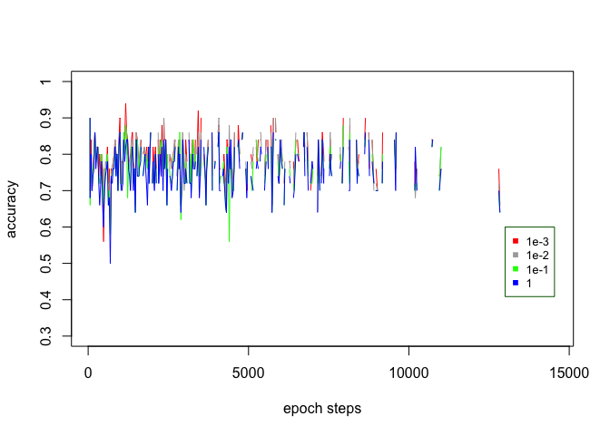
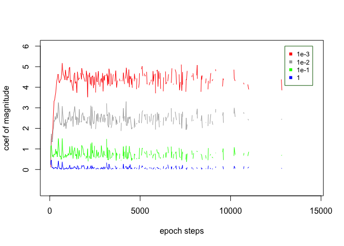

SVM\_Amitesh\_Shukla
================

## Train own implementation of Support Vector Machhine (no package used) on Adult data set (<https://archive.ics.uci.edu/ml/datasets/Adult> )

    ## Loading required package: lattice

    ## Loading required package: ggplot2

## Regularization: Finding appropriate gamma on training and validation data

``` r
stochastic_gradient_descent <- function(lambda,l) {
  set.seed(150)
  a <<- matrix(c(0.01, 0.01, 0.1, 0, 0, 0.2),nrow=6, ncol=1)
  for (epoch in 1:50) {
    #Hold 50 random training examples for evaluation at every 30 steps
    eval_sample<<-trainingData[sample(nrow(trainingData),size=50),]
    steplength = 1/(0.01*epoch + 50)
    sl = steplength*lambda
    counter = 1;
    for (steps in 1:300) {
         if (counter == 30) {
           for (i in 1:50) {
               validate<-as.matrix(eval_sample[i,-7])
               vlable<-eval_sample[i,7]
               cond<-(t(a)%*%as.vector(validate))+b
               if (cond > 1) {
                   result = 1 
               } else {
                   result = -1
               }
               gotrightvalidate <- result == vlable
               validate_score[i]<<-sum(gotrightvalidate)/
                  (sum(gotrightvalidate)+sum(!gotrightvalidate))
           }
           average_accuracy <- sum(validate_score)/50
           lamda_accuracy[l,epoch*(steps/30)]<<-average_accuracy
           coef_mag[l,epoch*(steps/30)]<<- t(a)%*%a
           epoch_steps[epoch*(steps/30)]<<-epoch*steps
           epoch_accuracy[epoch*(steps/30)]<<-epoch
           counter = 1;
         }
         counter = counter + 1
         batchsample <<-trainingData[sample(nrow(trainingData),size=1),]
         bsample <- batchsample[,-7]
         label = batchsample$V15
         lbl <- t(bsample) * label
         slbl <- steplength*-label
         vec <<- as.matrix(bsample)
         stlbl<- steplength*lbl
         plane <<- label*(t(a)%*%as.vector(vec) + b)
         detr <<- det(plane)
         
         if (detr >= 1.0) {
           a <<- (a - sl*a)
            b <<- b
         } else if (detr < 1.0) {
            a <<- (a - (sl*a - stlbl))
            b <<- b - slbl
         }
     }
    #Inner loop ends
  }
  #Outer loop ends
}
my_svm <- function() {
 set.seed(26)
 lambda <- c(1e-3, 1e-2, 1e-1, 1)
 for (l in 1:4) {
   stochastic_gradient_descent(lambda[l],l)
   a_list[,l]<<-a
   b_list[l]<<-b
 }
}
my_svm()
```

## Accuracy plot every 30 steps, for each value of the regularization constant

``` r
plot(epoch_steps,lamda_accuracy[1,],  type = "l",col="red", xlab = "epoch steps",ylab = "accuracy",yaxt="n",ylim=c(0.3,1),lwd=1, lty="solid")
ticks<-c(0.3,0.4,0.5,0.6,0.7,0.8,0.9,1)
axis(2,at=ticks,labels=ticks)
lines(epoch_steps,lamda_accuracy[2,],col="darkgrey",lty="solid",lwd=1)
lines(epoch_steps,lamda_accuracy[3,],col="green",lty="solid",lwd=1)
lines(epoch_steps,lamda_accuracy[4,],col="blue",lty="solid",lwd=1)
legend(13000, 0.6,pch=c(15,15,15,15),col=c("red","darkgrey","green","blue"),
c("1e-3", "1e-2", "1e-1", "1"),
bty="o",box.col="darkgreen", cex=.8)
```

<!-- -->

## The magnitude of the coefficient vector plot every 30 steps, for each value of the regularization constant.

``` r
plot(epoch_steps,coef_mag[1,],  type = "l",col="red", xlab = "epoch steps",ylab = "coef of magnitude",yaxt="n",ylim=c(-1,6),lwd=1, lty="solid")
ticks<-c(0,1,2,3,4,5,6)
axis(2,at=ticks,labels=ticks)
lines(epoch_steps,coef_mag[2,],col="darkgrey",lty="solid",lwd=1)
lines(epoch_steps,coef_mag[3,],col="green",lty="solid",lwd=1)
lines(epoch_steps,coef_mag[4,],col="blue",lty="solid",lwd=1)
legend(13000, 6, pch=c(15,15,15,15), col=c("red","darkgrey","green","blue"),
c("1e-3", "1e-2", "1e-1", "1"),bty="o",box.col="darkgreen", cex=.8)
```

<!-- -->

## Looking at the plots from 4 different chosen regularization constants, lambda=1e-3 looks the best of all the chosen lambda. 1e-1 & 1e are clearly worst performing with multiple low accuracy epochs clearly visible during the training. lamda 1e-3 & 1e-2 are somewhat similar in accuracy but 1e-3 looks to have better accuracy in multiple epochs. Cross validated error on randomly selected 50 training example every 30 steps for regularization constant 1e-3 looks to be better as compared to 1e-2. So 1e-3 is the best regularization constant among the ones chosen and cross-validated/tested on the validation data over the training steps.

## Accuracy on held out test data with the chosen regularization constant 1e-3.

``` r
 ## Accuracy on held out test data with the chosen regularization constant 1e-3.
 for (i in 1:nrow(testData)) {
     validate<-as.matrix(testData[i,-7])
     vlable<-testData[i,7]
     cond<-(t(a_list[,1])%*%as.vector(validate))+b_list[1]
     if (cond > 1) {
         result = 1 
     } else {
         result = -1
     }
     gotrightvalidate <- result == vlable
     validate_score[i]<-sum(gotrightvalidate)/
          (sum(gotrightvalidate)+sum(!gotrightvalidate))
 }
 average_accuracy <- sum(validate_score)/nrow(testData)
 average_accuracy
```

    ## [1] 0.7823149

``` r
 print(average_accuracy)
```

    ## [1] 0.7823149
